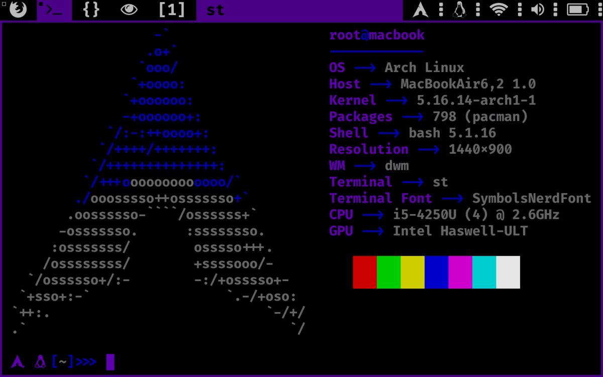

<div align="center">

# `archy`

<h3>
  An automatic full arch linux installation script using my setup.
</h3>

<!-- Badges -->


<!-- Demo image -->


</div>

<!-- TABLE OF CONTENTS -->
## Table of Contents

* [Setup ⚙️](#setup)
* [Credits 🤝](#credits)
* [License 📑](#license)

## Setup ⚙️

### Download the project:
```shell
pacman -S git
git clone https://github.com/nemo256/archy
cd archy
```

### Create or modify the <.env> file:
```shell
USERNAME=             # your username (eg: foo)
PASSWORD=             # your password (eg: bar)
HOSTNAME=             # your hostname (eg: macbook)
SHELL=                # preferred shell (eg: /bin/zsh)
TOKEN=                # this is the github token (you can leave it empty)
DISK=                 # disk you want to install archy on (eg: /dev/sda)
MOUNT_OPTIONS=        # disk mount options (eg: "noatime,compress=zstd,ssd,commit=120")
FS=                   # filesystem type (eg: ext4, btrfs...)
TIMEZONE=             # timezone like this <Continent/city> (eg: Europe/paris, America/chicago)
KEYMAP=               # keymap of the keyboard (eg: us, fr, es...)
REPO=                 # main archy repo.
ARCH=                 # architecture <eg: x86_64, i686, arm...>
```

### Make the scripts executable:
```shell
chmod +x install postinstall
```

### Run the installation: 
```shell
./install
```

## Credits 🤝
- Credits go to the developers of [Arch Linux](https://archlinux.org/).

## License 📑
- Please read [archy/LICENSE](https://github.com/nemo256/archy/blob/master/LICENSE)
